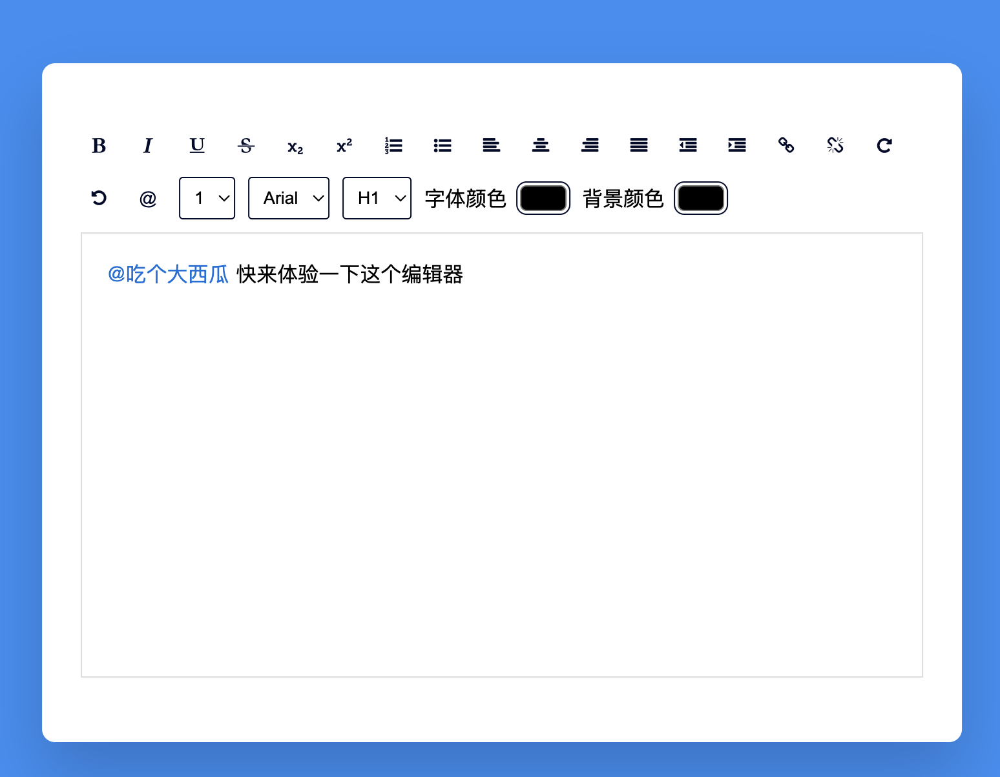

# More-editor


## 需求分析
- 需要显示`@某人`。采用css伪类显示@符号
- 控制样式。插入一段约定好格式的html代码，提前设置好样式类
- 点击时需要整体选中，删除时需要整体删除。可添加属性`contenteditable=false`

## 解决
刚开始使用的是，插入html方法
```js
document.execCommand("insertHTML", true, html);
```
发现以下几个问题：
- 无法插入span标签
- 无法插入空标签
- 会将用户插入的html片段优化处理

最终实现的效果


核心代码

```js
/**
 * 在光标处插入html节点
 * @param {*} node 
 */
function insertHTMLNode(node) {
  // 如果有选中的内容，就替换掉
  var selection = window.getSelection();
  var range = selection.getRangeAt(0);
  //   console.log(range);

  // 删除原有内容
  range.deleteContents();

  range.insertNode(node);

  //  移动光标到下一个输入点
  selection.collapseToEnd();
}
```

完整代码 : [https://github.com/mouday/more-editor](https://github.com/mouday/more-editor)
在线Demo: [https://mouday.github.io/more-editor/](https://mouday.github.io/more-editor/)

> 参考
> - [另一种场景下的js @提到好友](https://www.cnblogs.com/TheViper/p/4633745.html)
> - [web 前端 @ 功能 JS 实现分析及其原理](https://segmentfault.com/a/1190000007846897)
> - [富文本实现@选择人](https://www.cnblogs.com/gxp69/p/16130664.html)
> - [使用wangEditor富文本编辑器时，可以@具体的人](https://github.com/TStoneLee/At-Someone)
> - 视频：[【代码】Javascript小项目 | 富文本编辑器](https://www.bilibili.com/video/BV1oL4y1V7gb)
